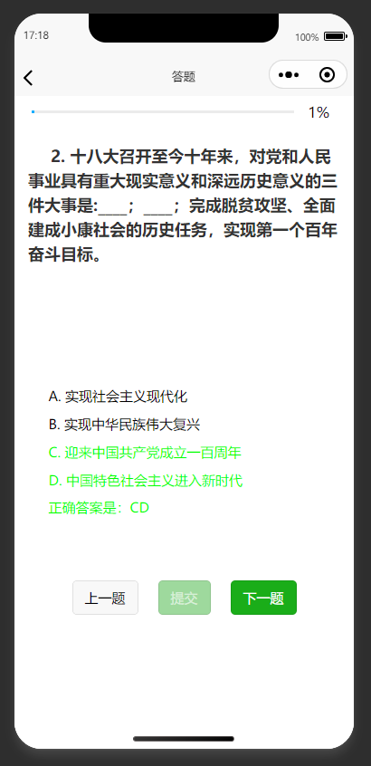

# uniapp-quiz

## Screenshot

## Build

Checkout `uniapp` documents.

## License

**MIT license**

*Also I couldn't care less about how you use my code, if it helps, then everything works out.*

## One more thing

I haven't really code much this year, so when someone came up with this opportunity to write a miniprogram, I took the job with much delight.

Previously I've been using Wechat's "native" framework to write theses, but I'd also never use `Vue` before, so I decided to take `uniapp` as a beginning.

Turns out, the amount of work required is actually much less than I would expect, with plenty document(both Eng and Chn), less bug and nonintuitive behaviors to overcome.

To be fair, I'm still personlly in favor of more "native" way to code, most of my App codes are written in `swift` or `rust`, they provide far more security and performance benifits over `js` and `ts`, but this experience with `uniapp` really does change my view on web-tech.

The project was init with `typescript`, but I quickly realized that the way `typescript` treats `json` file is a pain in the ass for this project, and I really don't want spend time debugging both `ts` and `js`, so `js`-only it is.

Alongside with all of that, I guess some people may have trouble finding about what this project intended to serve. I don't really care about any of that, you can checkout the origin questions and answers in`.\src\static\data.json`. I don't really intend to take it down unless asked, since perhaps someone who would find this repo might just have the same minniprogram to build. :D

If you have any questions or suggestions, you are welcome to bring them up in Issues. (Also I'm not that familiar with `Vue` synatx, so suggestions are greatly appreciated.)
